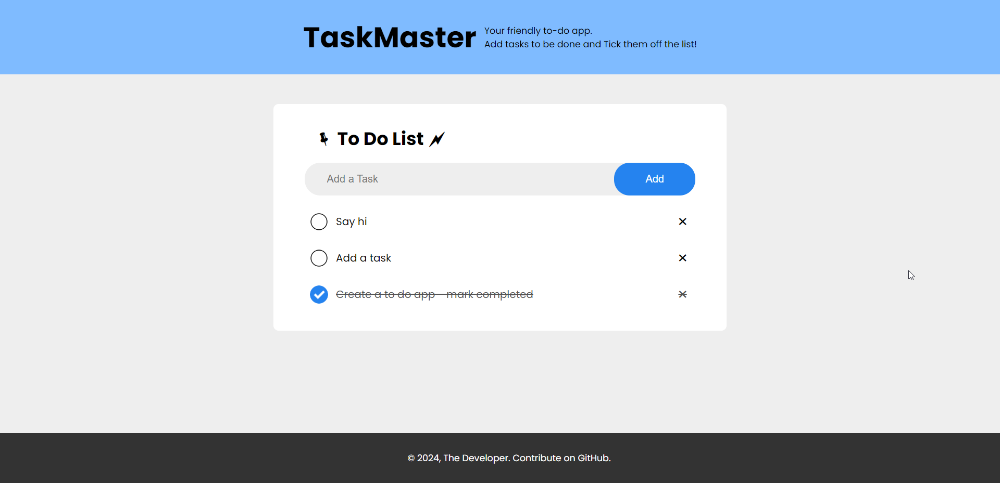

# TaskMaster: todo-app

To-do web app built using HTML, CSS, JavaScript.

Your friendly to-do web application built with HTML, CSS, and JavaScript. Features include adding, removing, and ticking off completed tasks, which is saved in your local browser.

### Technologies Used

- HTML (for creating the structure of web pages)
- CSS (for styling)
- JavaScript (for adding functionality)

### Usage

- Add a Task.
- Tick off completed Task.
- Delete a Task.

### To Do:

- [ ] Login/Signup
- [ ] Dark Mode

### Getting Started

- Clone the repository (`git clone <repository_url>`).
- Run in your browser.
